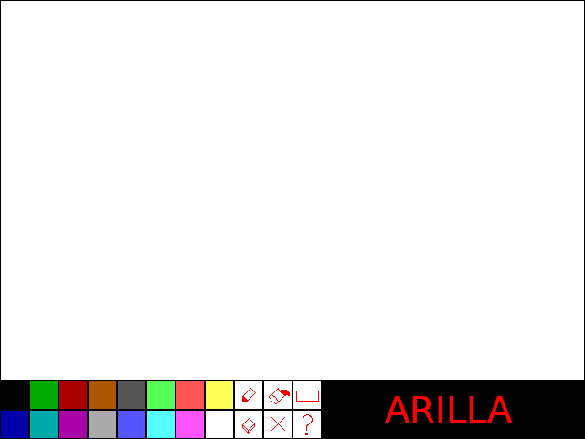

\newpage

# Uvodna reč

**Arilla** (**Ar**hitektura **I**vana, **L**azara, **L**uke i **A**lekse) je 16-bitni računarski sistem, sastavljen od procesora sa reči dužine 16 bita, 64 MB SDRAM radne memorije povezane memorijskom magistralom, kao i magistrale za periferije. Periferije namenjene za računar su VGA grafička kartica i PS/2 miš. Takođe sadrži i DMA kontroler. Računar je namenjen da izvršava jednostavan **Paint** program koji se nalazi u ROM memoriji. U ovom dokumentu nalazi se detaljna, ali ne potpuna i konačna specifikacija implementacije, počevši od samog procesora preko memorije do periferija, i na kraju samog softvera.

Redovi i rečenice označeni sa **(?)** predstavljaju nepotpune, neodlučene ili manje bitne mogućnosti i implementacione detalje. Ovaj dokument predstavlja samo grub prikaz arhitekture, koji će trpiti promene tokom razvoja i nakon dodatnih konsultacija.

# Procesor *AR3B72C*

## Arhitektura

Procesor je dvoadresni, modelovan kao load-store arhitekture nalik na RISC-V. Memorijska reč je 16 bita, isto kao i reč dostupnog SDRAM-a. Procesor sadrži registarski fajl sa 32 dostupna registra raznih namena. 

Širina adrese je neodlučena, zato što je ustanovljeno da za potrebe programa nije dovoljno velik prostor od 16 bita odnosno 65535 reči (pogledati odeljak Softver). Postoje 4 rešenja koje smo razmatrali:

1. Adrese se proširuju tako da zauzimaju 2 memorijske reči (32 bita). Ovime imamo pristup celom kapacitetu SDRAM čipa i dodatnu širinu. Ovo rešenje smanjuje elokvenciju i jednostavnost ostatka arhitekture.
2. Naknadno smanjenje programske upotrebe RAM memorije, dok adresa ostaje 16 bita
3. Nekakva segmentacija memorije ili bank-switching posebnim instrukcijama
4. Koristi se VRAM grafičke kartice za veći deo memorije koje koristi program, i pritom se koristi neko posebno adresiranje

Procesor sadrži jednostavnu formu *pipeline*-ovanja, gde se 2 faze izvršavaju paralelno:

1. **FETCH** odnosno dohvatanje instrukcije
2. **ADDR**, **EXEC** i **INTR** odnosno dohvatanje operanada, izvršavanje instrukcije i obrada prekida se izvršavaju serijski

## Skup instrukcija

Prateći princip load/store arhitekture, adresne instrukcije se dele na 2 tipa: one koje interaguju samo sa registrima (dužine 1 reč) i one koje interaguju sa memorijom ili neposrednim podacima (dužine 2 reči). Ostatak skupa čine bezadresne i instrukcije skoka.

- Bezadresne (1W): `000000<OPCODE(10)>`
- Relativnog skoka (1W): `<OPCODE(6)><OFFSET(10)>`
- Adresne (1W): `<OPCODE(6)><OP1/DEST REG(5)><OP2 REG(5)>`
- **(?)** Adresne sa neposrednim adresiranjem (1W): `<OPCODE(6)><OP1/DEST REG(5)><IMMED(5)>` (za male veličine, npr. +/-1, što bi povećalo efikasnost procesora kraćim dohvatanjem instrukcija)
- Apsolutnog skoka (2W): `000000<OPCODE(10)> <DEST(16)>`
- LOAD/STORE (2W): `<OPCODE(6)><SRC/DEST REG(5)><ADDR(5)><ADDR(16)>`
- **(?)** Adresne sa neposrednim adresiranjem (2W): `<OPCODE(6)><OP1/DEST REG(5)>10000 <IMMED(16)>`

Konkretan skup instrukcija je dobrim delom definisan potrebama softvera i biće dostupan naknadno.

Potencijalna adresiranja:

- *immed* - neposredno
- *memdir* - memorijsko direktno
- *memind* - memorijsko indirektno
- *regdir* - registarsko direktno
- *regind* - registarsko indirektno
- *regindpom* - registarsko indirektno sa pomerajem
- **(?)** *postinc* - registarsko indirektno sa postinkrementiranjem, ili slično
- **(?)** - adresiranja za VRAM, ukoliko se odluči za tu opciju

## Prekidi

Procesor podržava vektorizovane prekidne rutine, od toga 3 ili 7 maskirajućih prekida, potencijalno 1 nemaskirajući (za watchdog magistrale, fiksni ulaz 0), zatim prekid zbog greške u instrukciji (**FAULT**), prekid nakon svake instrukcije (**TRAP**) i softverski izazvan prekid (**INT**).

Pri prihvatanju prekida, periferije mogu preko magistrale da šalju broj ulaza ili adresu same rutine **(?)**.

**(?)** U **PSW** registru se, između ostalog, nalazi **I** bit, 2 ili 3 **L** bitova. Za maskiranje prekida postoji **IMR** registar. Za čuvanje adrese IV tabele, postoji **IVTP** registar.

# Memorija

Na raspolaganju na Altera Cyclone V razvojnoj ploči nam je SDRAM čim (najverovatnije [IS42/45S16320D](https://www.issi.com/WW/pdf/42-45R-S_86400D-16320D-32160D.pdf)) veličine 32M reči od 16 bita. U njega se smešta programski stek. Na raspolaganju su nam takođe 308 M10K blokova na FPGA čipu, ukupnog kapaciteta od 154K reči. Mesto smeštanja grafičke memorije još uvek nije poznato.

Program za izvršavanje se smešta u internu memoriju FPGA čipa.

# Magistrale

## Memorijska magistrala

Zasad je razrađeno da na memorijsku magistralu izlaze procesor, grafička kartica, kontroler memorije i DMA kontroler. Ova magistrala služi kako bi se preko nje komuniciralo sa SDRAM radi upisivanja ili čitanja podataka.

## Periferijska magistrala *PCIw*

Na periferijsku magistralu izlaze procesor, kontroler PS/2 miša, grafička kartica, DMA kontroler i, potencijalno, watchdog. Ova magistrala se koristi za slanje instrukcija i malih podataka (poput paketa od miša).

Magistrala je sinhrono/asinhrona, sa atomskim ciklusima i bez arbitracije. Za više informacija o načinu funkcionisanja ove magistrale pročitati [detaljnu specifikaciju sa referentnom implementacijom](https://lazar2222.github.io/ETF/PCIw.pdf).

# Grafička kartica

Grafička kartica imaće fiksnu rezoluciju 640x480@60 Hz (tj. *pixel clock* je 25 MHz).

Kartica sadrži paletu od 16 boja, tako da svaka boja staje u četiri bita i količine crvene/zelene/plave boje se čuvaju u grafičkoj kartici. Moguće je korisnički definisati 14 boja (2 fiksne su crna i bela) pomoću posebnih instrukcija GPU **(?)**. 

Odnos pristupa memoriji je 7:1, tj za 1 pristup memoriji od strane GPU, CPU ima vremena da obavi 7.

Nije još odlučeno da li će grafička kartica imati *line buffer* (640 piksela) ili jedan ili dva *frame buffer*-a.

Neophodan je jedan renderer za sprajtove (koji će se koristiti za kursor, pogledati odeljak Softver). Sprajt će se čuvati u posebnom delu VRAM, učitavaće se posebnom instrukcijom GPU. Sprajt je veličine 32x32 **(?)** i monohrom **(?)**,

# Periferije i kontroleri

## Miš

PS/2 miš se koristi za pomeranje kursora i crtanje po platnu (videti odeljak Softver). Kontroler na početku mora da mišu pošalje komandu da ga izveštava o pomerajima i kliktajima miša, a zatim će osluškivati za informacije od miša. Komunikacija se obavlja preko PS/2 protokola.

U kontroleru će se najverovatnije čuvati registri sa apsolutnim X i Y koordinatama miša koji će se preko magistrale slati procesoru, zajedno sa trenutnim statusom miša (da li je pritisnuto levo dugme, da li je pritisnuto desno dugme, itd.)

## DMA kontroler

DMA kontroler će vršiti isključivo memorija-memorija prenose sa sledećim parametrima:

- Odredište (DEST)
- Izvorište (SRC)
- Broj podataka (CNT)
- Da li se popunjava odredište samo prvom vrednošću iz izvora ili se redom čitaju vrednosti pa njima popunjava (REPEAT)

## Kontroler memorije

Služi za apstrahovanje pristupa SDRAM. Konkretni planovi oko implementacije i interfejsa ovog kontrolera još uvek nisu napravljeni.

# Softver

## Pregled funkcionalnosti programa

Program *Paint* služi za crtanje skica na računaru pomoću miša, nalik na sadašnje korisničke programe te svrhe. Korisnik kursorom miša bira alate i crta po platnu. Program se sastoji od jednog dijaloga koji sadrži platno (gore) i traku sa alatima i bojama (dole). Program pamti stanje platna, kao i trenutno izabran alat, primarnu i sekundarnu izabranu boju.

## Platno

Platno je rezolucije 640x400 i podržava 16 boja u jednom video-okviru (boje se mogu mapirati iz šireg skupa pomoću instrukcija grafičke kartice **(?)**, ali u jednom video-okviru u jednom trenutku je moguće iscrtati samo 16 boja). Ovaj prostor boja je podržan u svakom pikselu, tj. ne postoji nikakva kompresija prostora boja ili same rezolucije platna. Platno se čuva u radnoj memoriji računara. 

Kao matrica, linearizuje se po redovima (horizontalnim linijama od 640 piksela) kao kontinualni blok u RAM memoriji. Jedna memorijska reč (16 bita) sadrži 4 piksela (4 bita, dakle 16 boja). $640 \times 400 = 250 000$ piksela, podeljeno sa 4 čini ukupno 64 000 memorijskih reči. Pojedinačni pikseli se manipulišu pomoću instrukcija pomeranja i maskiranja.

## Skup alata

* **Olovka:** Crta piksele izabrane boje na izabranoj poziciji
* **Linija:** Crta liniju piksela između dve izabrane pozicije (miš se prevlači od jedne do druge pozicije)
* **Pravougaonik:** Crta pravougaonik čiji su gornji levi i donji desni ugao na izabranim pozicijama (miš se prevlači od jedne do druge pozicije)
* **(?)** **Teksturna olovka:** Kao olovka, samo umesto boje crta određenu teksturu po platnu
* **Kanta za boju** (*Paint Bucket*): Sve piksele iste boje u okolini izabrane pozicije zamenjuje sa izabranom bojom
* **Brisanje platna:** Celo platno zamenjuje belom bojom

## Interagovanje korisnika sa programom

Celokupna interakcija se sastoji od miša. Levim klikom se na platno upotrebljava trenutno izabrani alat. U predelu trake sa alatima, levi klik u prostoru "tastera" određenog alata ga postavlja za trenutno izabrani, osim alata za brisanje platna. U predelu trake sa bojama, levi klik na određenu boju je postavlja za trenutno izabranu primarnu boju, a desni klik postavlja kao sekundarnu.

Kod alata *Olovka*, skrol miša menja veličinu same olovke u jedinicama zahvaćenih piksela. 

Interakcija kursora sa programom se realizuje pomoću prekidne rutine za miš, koji proverava poziciju kursora i u odnosu toga odlučuje da li je u predelu platna ili trake alata. U slučaju trake alata, postavljaju se promene u stanje programa, a u slučaju platna se proverava da li je miš kliknut, tako da se izvrši funkcija alata, pa onda da li je miš pomeren, da bi se izvršilo ažuriranje pozicije kursora.
